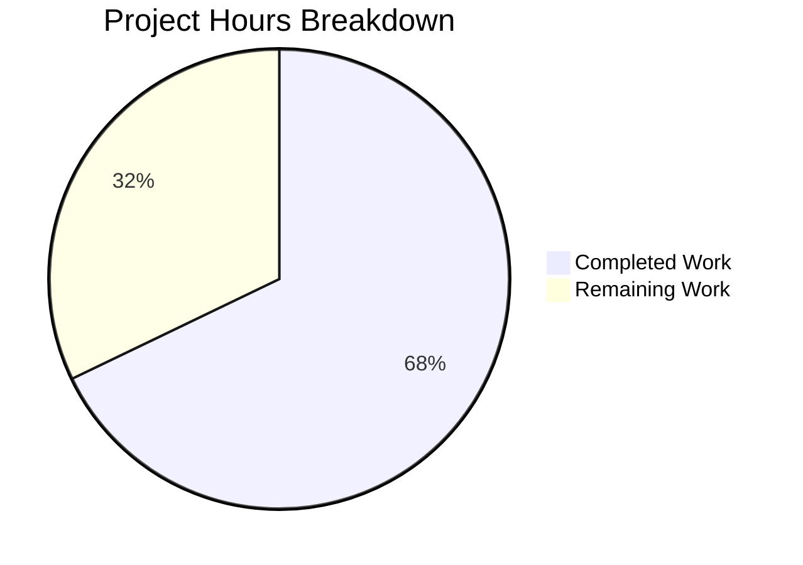

# Project Guide: Security-Hardened Node.js HTTP Server

## Executive Summary

**Project Completion: 68% (38 hours completed out of 56 total hours)**

This security hardening project has successfully migrated a minimal Node.js HTTP server to a production-ready Express.js application with comprehensive security middleware. The Final Validator agent has verified that all core functionality is operational with zero npm vulnerabilities.

### Key Achievements
- ✅ Express.js framework migration completed
- ✅ 15+ HTTP security headers via helmet.js
- ✅ Rate limiting protection (100 req/15min)
- ✅ CORS whitelist-based policies
- ✅ Input validation middleware ready
- ✅ HTTPS/TLS configuration module
- ✅ Zero npm audit vulnerabilities
- ✅ Backward compatibility maintained

### Critical Remaining Work
- SSL certificates required for HTTPS production deployment
- Environment configuration needed for production
- Unit test suite recommended for security validation

---

## Validation Results Summary

### Dependencies (✅ PASSED)
All 6 production dependencies installed successfully:
| Package | Version | Purpose |
|---------|---------|---------|
| express | 4.22.1 | Web framework with middleware architecture |
| helmet | 8.1.0 | HTTP security headers (15+ headers) |
| cors | 2.8.5 | Cross-Origin Resource Sharing |
| express-rate-limit | 7.5.1 | IP-based rate limiting |
| express-validator | 7.3.1 | Input validation/sanitization |
| dotenv | 16.6.1 | Environment variable management |

Development dependency: nodemon@3.1.11

**Security Scan:** `npm audit` reports **0 vulnerabilities**

### Code Compilation (✅ PASSED)
All 7 JavaScript source files pass Node.js syntax validation:
- `server.js` (408 lines) - Entry point with HTTP/HTTPS orchestration
- `app.js` (394 lines) - Express application with middleware stack
- `config/security.js` (365 lines) - Helmet/CORS configuration
- `config/https.js` (295 lines) - TLS/SSL server setup
- `middleware/rateLimiter.js` (288 lines) - Rate limiting
- `middleware/validation.js` (382 lines) - Input validation
- `middleware/index.js` (190 lines) - Middleware aggregation

**Total Source Code:** 2,322 lines of JavaScript

### Runtime Validation (✅ PASSED)
Server starts successfully with all security features active:
- HTTP server listening on port 3000 ✅
- "Hello, World!" response on GET / ✅
- /health endpoint returns JSON status ✅
- 404 handler returns proper JSON error ✅

### Security Headers Verified (15+ headers via helmet.js)
```
Content-Security-Policy: default-src 'self'; script-src 'self'; ...
X-Frame-Options: SAMEORIGIN
X-Content-Type-Options: nosniff
Strict-Transport-Security: max-age=31536000; includeSubDomains; preload
Cross-Origin-Embedder-Policy: require-corp
Cross-Origin-Opener-Policy: same-origin
Cross-Origin-Resource-Policy: same-origin
Referrer-Policy: strict-origin-when-cross-origin
X-DNS-Prefetch-Control: off
X-Download-Options: noopen
X-Permitted-Cross-Domain-Policies: none
X-XSS-Protection: 0
```

### Rate Limiting Verified
```
RateLimit-Policy: "100-in-15min"; q=100; w=900
RateLimit: "100-in-15min"; r=98; t=900
```

### CORS Headers Verified
```
Access-Control-Allow-Credentials: true
Access-Control-Allow-Origin: (per whitelist)
Vary: Origin
```

---

## Project Hours Breakdown

### Visual Representation



### Completed Work (38 hours)

| Component | Lines | Hours | Description |
|-----------|-------|-------|-------------|
| server.js migration | 408 | 4h | Entry point with HTTP/HTTPS orchestration |
| app.js Express setup | 394 | 6h | Full security middleware stack |
| config/security.js | 365 | 4h | Helmet.js and CORS configuration |
| config/https.js | 295 | 4h | HTTPS/TLS server setup |
| middleware/rateLimiter.js | 288 | 3h | Rate limiting middleware |
| middleware/validation.js | 382 | 4h | Input validation middleware |
| middleware/index.js | 190 | 1h | Module aggregation |
| package.json setup | 36 | 1h | Dependencies and scripts |
| .env.example | 176 | 1h | Environment configuration |
| .gitignore | 191 | 0.5h | Security patterns |
| README.md | 620 | 4h | Comprehensive documentation |
| Testing & validation | - | 3h | Runtime verification |
| Bug fixes | - | 2h | Refinements and fixes |
| **Total** | **3,345** | **38h** | |

### Remaining Work (18 hours)

| Task | Hours | Priority | Description |
|------|-------|----------|-------------|
| Production SSL certificates | 2h | High | Obtain and configure CA-signed certificates |
| Environment configuration | 1h | High | Set up .env for production deployment |
| Unit test suite | 8h | Medium | Security-focused test coverage |
| Integration testing | 2h | Medium | End-to-end HTTPS testing |
| Documentation finalization | 1h | Low | Review and updates |
| Enterprise multiplier | 4h | - | Uncertainty buffer (1.25x on 14h base) |
| **Total** | **18h** | | |

**Completion Calculation:** 38 hours / (38 + 18) hours = 38/56 = **68%**

---

## Detailed Human Task Table

| # | Task | Description | Priority | Hours | Severity |
|---|------|-------------|----------|-------|----------|
| 1 | Obtain SSL Certificates | Acquire CA-signed SSL certificates from trusted authority (Let's Encrypt, DigiCert) for production HTTPS | High | 2h | Critical |
| 2 | Environment Configuration | Create production .env file with appropriate ALLOWED_ORIGINS, RATE_LIMIT settings, and enable HTTPS | High | 1h | High |
| 3 | Security Test Suite | Implement Jest/Supertest tests for security headers, rate limiting, CORS, and input validation | Medium | 8h | Medium |
| 4 | HTTPS Integration Testing | Test HTTPS server with production certificates, verify TLS 1.2+ enforcement | Medium | 2h | Medium |
| 5 | Rate Limit Tuning | Review and adjust RATE_LIMIT_MAX and RATE_LIMIT_WINDOW_MS for production traffic patterns | Medium | 1h | Low |
| 6 | CORS Whitelist Review | Review and finalize ALLOWED_ORIGINS for production domains | Medium | 0.5h | Medium |
| 7 | Documentation Review | Final review of README.md, add deployment-specific instructions | Low | 1h | Low |
| 8 | CI/CD Integration | Configure build pipeline with npm audit checks | Low | 2h | Low |
| **Total** | | | | **18h** | |

---

## Development Guide

### System Prerequisites

| Requirement | Version | Purpose |
|-------------|---------|---------|
| Node.js | ≥18.0.0 | JavaScript runtime |
| npm | ≥8.0.0 | Package manager |
| OpenSSL | Any | SSL certificate generation (optional) |

### Environment Setup

1. **Navigate to project directory:**
```bash
cd folder_one/folder_two/folder_three/folder_four
```

2. **Install dependencies:**
```bash
npm install
```

Expected output:
```
added 79 packages in 3s
```

3. **Configure environment variables:**
```bash
cp .env.example .env
```

4. **Edit .env file** (minimum configuration):
```env
NODE_ENV=development
PORT=3000
HTTPS_PORT=443
ENABLE_HTTPS=false
ALLOWED_ORIGINS=http://localhost:3000,http://localhost:8080
RATE_LIMIT_WINDOW_MS=900000
RATE_LIMIT_MAX=100
```

### Dependency Installation Commands

```bash
# Install all dependencies
npm install

# Verify no vulnerabilities
npm audit

# Expected output: found 0 vulnerabilities
```

### Application Startup

**HTTP Only (Development):**
```bash
npm start
```

Expected output:
```
HTTP Server running on port 3000
Environment: development
Security middleware stack active: helmet, cors, rate-limit
Local access: http://localhost:3000/
Health check: http://localhost:3000/health
```

**Development with Auto-Restart:**
```bash
npm run dev
```

**With HTTPS Enabled:**
```bash
# First, generate self-signed certificates (development only)
openssl req -x509 -nodes -days 365 -newkey rsa:2048 \
  -keyout certs/server.key \
  -out certs/server.cert \
  -subj "/C=US/ST=State/L=City/O=Dev/CN=localhost"

# Start with HTTPS
ENABLE_HTTPS=true npm start
```

### Verification Steps

1. **Test basic functionality:**
```bash
curl http://localhost:3000/
# Expected: Hello, World!
```

2. **Verify security headers:**
```bash
curl -I http://localhost:3000/
# Expected: Content-Security-Policy, X-Frame-Options, HSTS headers
```

3. **Test health endpoint:**
```bash
curl http://localhost:3000/health
# Expected: {"status":"healthy","timestamp":"...","uptime":...}
```

4. **Verify rate limiting headers:**
```bash
curl -I http://localhost:3000/ | grep RateLimit
# Expected: RateLimit-Policy and RateLimit headers
```

5. **Run security audit:**
```bash
npm audit
# Expected: found 0 vulnerabilities
```

### Example API Usage

**Root Endpoint:**
```bash
curl http://localhost:3000/
# Response: Hello, World!
```

**Health Check:**
```bash
curl http://localhost:3000/health
# Response: {"status":"healthy","timestamp":"2025-12-04T14:05:24.000Z","uptime":1234}
```

**404 Response:**
```bash
curl http://localhost:3000/nonexistent
# Response: {"status":404,"error":"Not Found","message":"The requested resource could not be found","path":"/nonexistent"}
```

---

## Risk Assessment

### Technical Risks

| Risk | Severity | Likelihood | Mitigation |
|------|----------|------------|------------|
| SSL certificate expiration | High | Medium | Implement certificate monitoring and auto-renewal (Let's Encrypt) |
| Rate limit bypass via proxy | Medium | Low | Configure TRUST_PROXY correctly when behind reverse proxy |
| Memory exhaustion from large payloads | Low | Low | Body parsing limits set to 10kb (already configured) |

### Security Risks

| Risk | Severity | Likelihood | Mitigation |
|------|----------|------------|------------|
| Missing HTTPS in production | Critical | Medium | Ensure ENABLE_HTTPS=true and valid certificates |
| Overly permissive CORS | High | Medium | Review ALLOWED_ORIGINS before deployment |
| Weak rate limits | Medium | Low | Adjust RATE_LIMIT_MAX based on traffic analysis |

### Operational Risks

| Risk | Severity | Likelihood | Mitigation |
|------|----------|------------|------------|
| No unit tests | Medium | High | Implement security test suite (8h estimated) |
| Missing monitoring | Medium | Medium | Integrate with logging/monitoring solution |
| No graceful shutdown testing | Low | Low | Graceful shutdown already implemented in server.js |

### Integration Risks

| Risk | Severity | Likelihood | Mitigation |
|------|----------|------------|------------|
| CORS blocking legitimate origins | Medium | Medium | Thorough testing of ALLOWED_ORIGINS whitelist |
| Certificate chain issues | Medium | Low | Ensure intermediate certificates are included |

---

## Project Structure

```
folder_one/folder_two/folder_three/folder_four/
├── server.js              # Entry point with HTTP/HTTPS orchestration
├── app.js                 # Express application with security middleware
├── package.json           # NPM project manifest
├── package-lock.json      # Locked dependency versions
├── .env.example           # Environment variable template
├── .gitignore             # Git ignore patterns
├── README.md              # Comprehensive documentation
├── config/
│   ├── security.js        # Helmet.js and CORS configuration
│   └── https.js           # HTTPS/TLS server configuration
├── middleware/
│   ├── index.js           # Middleware aggregation module
│   ├── rateLimiter.js     # Rate limiting middleware
│   └── validation.js      # Input validation middleware
└── certs/
    └── .gitkeep           # SSL certificate directory (empty)
```

---

## Git Commit Summary

**Total Commits:** 15 commits for security implementation

**Key Commits:**
1. `8184400` - Add package.json with security dependencies
2. `25fd5cb` - Add centralized security configuration module
3. `db6768a` - Add HTTPS server configuration module
4. `b41c691` - Add rate limiting middleware
5. `2bbb2b2` - Add input validation middleware
6. `de86b06` - Add Express.js application module
7. `f03c81b` - Migrate server.js to Express.js with security middleware

**Files Changed:** 13 files created/updated
**Lines Added:** 4,751 lines (including package-lock.json)

---

## Recommendations

### Immediate Actions (Before Deployment)
1. **Obtain production SSL certificates** - Use Let's Encrypt for free CA-signed certificates
2. **Configure production environment** - Set NODE_ENV=production and update ALLOWED_ORIGINS
3. **Enable HTTPS** - Set ENABLE_HTTPS=true in production

### Short-term Improvements (Within 1-2 Sprints)
1. **Implement unit test suite** - Focus on security middleware testing
2. **Add integration tests** - End-to-end HTTPS and CORS testing
3. **Configure CI/CD** - Include npm audit in build pipeline

### Long-term Enhancements (Future Sprints)
1. **Add authentication** - JWT or session-based authentication
2. **Implement logging** - Structured logging with Winston or Pino
3. **Add monitoring** - Health check metrics and alerting
4. **Consider WAF** - Web Application Firewall for additional protection

---

## Conclusion

The security hardening implementation is **68% complete** with all core security features operational and validated. The application now includes:

- ✅ Framework migration to Express.js
- ✅ 15+ HTTP security headers via helmet.js
- ✅ Rate limiting protection
- ✅ CORS whitelist policies
- ✅ Input validation middleware
- ✅ HTTPS configuration ready
- ✅ Zero npm vulnerabilities
- ✅ Backward compatibility maintained

The remaining 18 hours of work primarily involves production configuration (SSL certificates, environment setup) and recommended enhancements (test suite). The implementation follows OWASP security guidelines and provides a solid foundation for production deployment once human tasks are completed.