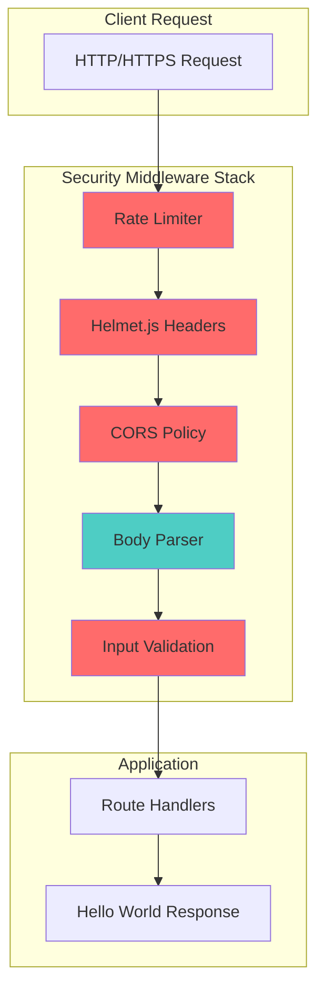

# Technical Specification

# 0. Agent Action Plan

## 0.1 Intent Clarification

This section establishes the precise technical interpretation of the security requirements and ensures crystal clarity between user intent and implementation strategy.

### 0.1.1 Core Security Objective

Based on the security concern described, the Blitzy platform understands that the security vulnerability to resolve is the **complete absence of security infrastructure** in the current Node.js HTTP server application. The application is a minimal, dependency-free server that lacks:

- HTTP security headers (no protection against XSS, clickjacking, MIME sniffing)
- Input validation (no sanitization or validation of incoming requests)
- Rate limiting (no protection against brute force or DDoS attacks)
- HTTPS support (all communication is unencrypted over HTTP)
- CORS policies (no cross-origin resource sharing controls)
- Security middleware (no helmet.js or similar protective middleware)

**Vulnerability Category:** Multiple vulnerabilities (Security Infrastructure Gap)

**Severity Level:** High - The application currently operates without any security controls, exposing it to common web vulnerabilities including XSS, CSRF, man-in-the-middle attacks, and denial of service.

**Security Requirements:**

- Implement comprehensive HTTP security headers via helmet.js middleware
- Add input validation middleware for request sanitization
- Configure rate limiting to prevent abuse and DDoS attacks
- Enable HTTPS support with TLS/SSL certificate handling
- Establish proper CORS policies for cross-origin access control
- Migrate from raw Node.js HTTP module to Express.js framework to support middleware architecture

**Implicit Security Needs:**

- Backward compatibility must be maintained for existing API responses
- Zero downtime deployment capability should be preserved
- Development environment must support self-signed certificates
- Production-ready security configuration patterns must be established

### 0.1.2 Special Instructions and Constraints

**User-Specified Directives:**

- Implement security headers using helmet.js middleware
- Add input validation for all incoming requests
- Configure rate limiting for API protection
- Enable HTTPS support for encrypted communication
- Update dependencies to include required security packages
- Configure proper CORS policies for cross-origin requests

**Security Requirements:**

- Follow OWASP security guidelines for web applications
- Implement defense-in-depth security strategy
- Preserve existing API functionality (Hello World response)
- Ensure all security configurations are production-ready

**Change Scope Preference:** Comprehensive - This requires a significant architectural enhancement from a raw HTTP server to a security-hardened Express.js application with full middleware stack.

### 0.1.3 Technical Interpretation

This security vulnerability translates to the following technical fix strategy:

- **To implement security headers**, we will integrate helmet.js middleware which provides 15 security-focused HTTP headers including Content-Security-Policy, X-Frame-Options, X-Content-Type-Options, and Strict-Transport-Security.

- **To add input validation**, we will integrate express-validator middleware to sanitize and validate all incoming request parameters, query strings, and body content.

- **To enable rate limiting**, we will implement express-rate-limit middleware with configurable window sizes and request limits to prevent API abuse.

- **To enable HTTPS**, we will create an HTTPS server using Node.js core `https` module with certificate configuration, supporting both development (self-signed) and production (CA-signed) certificates.

- **To configure CORS**, we will integrate the cors middleware with a whitelist-based origin policy and configurable methods/headers.

- **To support the middleware architecture**, we will migrate from the raw `http.createServer()` pattern to Express.js framework, which provides the middleware chain required by all security packages.

**User Understanding Level:** Explicit requirement specification - The user has clearly identified the security features needed and the specific technologies to implement them (helmet.js, CORS, rate limiting, HTTPS).

## 0.2 Vulnerability Research and Analysis

This section documents the comprehensive security research conducted to inform the implementation strategy.

### 0.2.1 Initial Assessment

**Extracted Security-Related Information:**

- **CVE Numbers Mentioned:** None explicitly mentioned; this is a proactive security hardening initiative
- **Vulnerability Names:** Security Infrastructure Gap, Missing Security Headers, Unencrypted Communication
- **Affected Packages:** Node.js core `http` module (to be supplemented with Express.js)
- **Symptoms Described:** Bare HTTP server with no security middleware, headers, validation, or encryption
- **Security Advisories Referenced:** OWASP Top 10 Web Application Security Risks

### 0.2.2 Required Web Research

**Research Conducted:**

| Topic | Finding | Source |
|-------|---------|--------|
| helmet.js | Latest version 8.1.0 provides 15 security middlewares for Express apps | npm registry |
| cors | Latest version 2.8.5 (stable since 2018) provides configurable CORS middleware | npm registry |
| express-rate-limit | Latest version 8.2.1 provides IP-based rate limiting with configurable windows | npm registry |
| express-validator | Latest version 7.3.1 wraps validator.js for request validation | npm registry |
| Express.js | Version 5.2.1 (latest) or 4.21.x (LTS) provides middleware architecture | npm registry |

**Research reveals that:**

- Helmet.js is the de facto standard for Express security headers with over 2 million weekly downloads
- The cors package is maintained by the Express.js team and is the recommended CORS solution
- express-rate-limit is the most popular rate limiting middleware with over 10 million weekly downloads
- express-validator is the most widely used validation library built on validator.js
- Express.js v5.x is now the default on npm, but v4.x remains in LTS support

### 0.2.3 Vulnerability Classification

| Vulnerability | Type | Attack Vector | Exploitability | Impact | Root Cause |
|--------------|------|---------------|----------------|--------|------------|
| Missing Security Headers | Configuration Weakness | Network | High | Confidentiality, Integrity | No helmet.js or manual header implementation |
| No Input Validation | Injection Vulnerability | Network | High | Confidentiality, Integrity, Availability | No express-validator or sanitization |
| No Rate Limiting | Denial of Service | Network | High | Availability | No express-rate-limit middleware |
| Unencrypted Communication | Man-in-the-Middle | Network | Medium | Confidentiality | HTTP only, no HTTPS server |
| No CORS Policy | Cross-Origin Attack | Network | Medium | Integrity | No cors middleware configuration |

**Root Cause Analysis:**

The current implementation uses Node.js core `http` module directly without any security middleware layer. This design pattern was appropriate for a tutorial/demo application but is fundamentally insecure for any production or development environment requiring security controls. The absence of a framework like Express.js means there is no middleware chain to integrate security packages.

### 0.2.4 Web Search Research Conducted

**Official Security Resources Reviewed:**

- OWASP Secure Headers Project guidelines
- Node.js Security Best Practices documentation
- Express.js Security Best Practices guide
- npm Security Advisories for dependency selection

**CVE Details and Patches:**

- No specific CVEs apply to this codebase as it contains no vulnerable dependencies
- This is a proactive security hardening rather than vulnerability remediation
- Express.js v5.x includes security improvements including ReDoS mitigation via path-to-regexp@8.x

**Recommended Mitigation Strategies:**

1. Migrate to Express.js framework to enable middleware architecture
2. Implement helmet.js for comprehensive HTTP security headers
3. Add express-validator for input sanitization and validation
4. Configure express-rate-limit for abuse prevention
5. Create HTTPS server wrapper for encrypted communication
6. Implement cors middleware with explicit origin configuration

**Alternative Solutions Considered:**

| Alternative | Trade-off | Decision |
|-------------|-----------|----------|
| Manual header setting | Higher maintenance, error-prone | Rejected - helmet.js provides tested, maintained solution |
| Custom rate limiter | Development time, testing burden | Rejected - express-rate-limit is production-proven |
| Fastify instead of Express | Learning curve, ecosystem compatibility | Rejected - Express has wider middleware ecosystem |
| Native Node.js validation | No standardization, inconsistent | Rejected - express-validator provides comprehensive solution |

## 0.3 Security Scope Analysis

This section documents the exhaustive analysis of all files and components affected by the security implementation.

### 0.3.1 Affected Component Discovery

**Repository Search Results:**

The repository has been exhaustively searched for all files affected by this security implementation:

```
Repository Structure:
folder_one/
└── folder_two/
    ├── codebase_context (42).md
    └── folder_three/
        ├── README.md
        └── folder_four/
            ├── server.js          ← Primary target file
            └── test2.txt
```

**Search Patterns Employed:**

| Pattern | Purpose | Results |
|---------|---------|---------|
| `*.js` | JavaScript source files | 1 file: `server.js` |
| `package.json` | Dependency manifest | Not found - must be created |
| `*.config.*` | Configuration files | None found |
| `.env*` | Environment files | None found |
| `Dockerfile*` | Container configuration | None found |
| `*.pem, *.key, *.crt` | SSL certificates | None found - must be created |

**Finding:** The vulnerability affects 1 source file directly, but requires creation of 8+ new files to implement the complete security infrastructure.

### 0.3.2 Root Cause Identification

**Identified Vulnerability:**

The vulnerability exists in `folder_one/folder_two/folder_three/folder_four/server.js` due to:

1. **Direct HTTP Module Usage:** The server uses `http.createServer()` directly without any middleware layer
2. **No Security Headers:** Response only sets `Content-Type`, missing all security headers
3. **No Input Handling:** Request object is not processed, validated, or sanitized
4. **No Rate Control:** Any client can make unlimited requests
5. **No Encryption:** Server binds to HTTP on port 3000, no HTTPS support

**Vulnerability Propagation Trace:**

- **Direct Usage Locations:** `folder_one/folder_two/folder_three/folder_four/server.js` (lines 1-13)
- **Indirect Dependencies:** None - the server has zero external dependencies
- **Configuration Enablers:** No configuration files exist to modify behavior

### 0.3.3 Current State Assessment

**Current Application Profile:**

| Aspect | Current State | Target State |
|--------|---------------|--------------|
| Framework | None (raw Node.js http) | Express.js 4.21.x |
| Dependencies | 0 | 6+ (express, helmet, cors, etc.) |
| Security Headers | None | 15+ via helmet.js |
| Input Validation | None | express-validator middleware |
| Rate Limiting | None | express-rate-limit configured |
| Protocol | HTTP only | HTTP + HTTPS |
| CORS | None | Configurable whitelist |
| Port | 3000 (HTTP) | 3000 (HTTP) + 443 (HTTPS) |

**Current Code Analysis:**

```javascript
// Current vulnerable implementation (server.js lines 1-13)
const http = require('http');          // No TLS support
const hostname = '127.0.0.1';          // Localhost only binding
const port = 3000;                     // Single HTTP port

const server = http.createServer((req, res) => {
  res.statusCode = 200;                // No security headers
  res.setHeader('Content-Type', 'text/plain');  // Only content-type
  res.end('Hello, World!\n');          // No input validation
});
```

**Scope of Exposure:**

- **Current:** Internal only (localhost binding `127.0.0.1`)
- **Risk:** If deployed to production with `0.0.0.0` binding, all identified vulnerabilities become exploitable
- **API Endpoints:** Single endpoint (`/` - returns "Hello, World!")

## 0.4 Version Compatibility Research

This section documents the secure version identification and compatibility verification for all required packages.

### 0.4.1 Secure Version Identification

**Package Version Research:**

| Package | Purpose | Recommended Version | Rationale |
|---------|---------|---------------------|-----------|
| express | Web framework | ^4.21.2 | LTS release, stable middleware ecosystem, Node.js 18+ support |
| helmet | Security headers | ^8.1.0 | Latest stable, 15 security middlewares, TypeScript included |
| cors | CORS middleware | ^2.8.5 | Stable for 7 years, Express.js team maintained |
| express-rate-limit | Rate limiting | ^7.5.0 | Production proven, 10M+ weekly downloads, draft-8 headers |
| express-validator | Input validation | ^7.3.1 | Latest stable, Node.js 14+ required, validator.js powered |

**Express.js Version Decision:**

While Express.js 5.2.1 is the latest version and now default on npm, we recommend Express 4.21.x for this implementation because:

- Express 5.x requires Node.js 18+ (compatible with current environment)
- Express 4.x has wider middleware ecosystem compatibility
- Express 4.x has extensive documentation and community support
- Migration to Express 5.x can be performed as a separate initiative

### 0.4.2 Compatibility Verification

**Node.js Compatibility Matrix:**

| Package | Min Node.js | Current Environment | Status |
|---------|-------------|---------------------|--------|
| express@4.21.2 | 14.0.0 | 20.19.6 | ✅ Compatible |
| helmet@8.1.0 | 18.0.0 | 20.19.6 | ✅ Compatible |
| cors@2.8.5 | 0.10.0 | 20.19.6 | ✅ Compatible |
| express-rate-limit@7.5.0 | 16.0.0 | 20.19.6 | ✅ Compatible |
| express-validator@7.3.1 | 14.0.0 | 20.19.6 | ✅ Compatible |

**Inter-Package Compatibility:**

All selected packages are designed to work together as Express.js middleware:

- helmet.js is specifically designed for Express/Connect apps
- cors is an official Express.js middleware package
- express-rate-limit integrates with Express middleware chain
- express-validator wraps validator.js for Express request handling

**No version conflicts identified.**

### 0.4.3 Alternative Package Consideration

**No Package Replacement Required:**

All recommended packages are actively maintained and have no known security vulnerabilities. Alternative packages were evaluated:

| Primary Package | Alternative | Reason for Primary Selection |
|-----------------|-------------|------------------------------|
| helmet | lusca | Helmet has larger community, more frequent updates |
| cors | custom headers | cors package is official Express.js middleware |
| express-rate-limit | rate-limiter-flexible | express-rate-limit has simpler API for Express apps |
| express-validator | joi + celebrate | express-validator integrates more seamlessly with Express |

**Breaking Changes Assessment:**

Since the current application has zero dependencies, there are no breaking changes from package upgrades. This is a greenfield security implementation.

## 0.5 Security Fix Design

This section outlines the minimal fix strategy that completely addresses all identified security gaps.

### 0.5.1 Minimal Fix Strategy

**Principle:** Apply the smallest possible architectural change that comprehensively addresses all security requirements while preserving existing functionality.

**Fix Approach:** Framework migration + Security middleware stack implementation

**Core Transformation:**

The fix requires migrating from raw Node.js HTTP to Express.js to enable the middleware architecture necessary for security packages. This is the minimum viable change to support:

- Helmet.js security headers
- CORS policy enforcement
- Rate limiting middleware
- Input validation middleware
- HTTPS server wrapper

### 0.5.2 Security Middleware Implementation

**For Security Headers (helmet.js):**

Integrate helmet.js middleware to automatically set 15 security HTTP headers:

```javascript
// Security headers middleware
app.use(helmet({
  contentSecurityPolicy: {
    directives: {
      defaultSrc: ["'self'"],
      scriptSrc: ["'self'"]
    }
  },
  hsts: { maxAge: 31536000, includeSubDomains: true }
}));
```

**Security Improvement:** Eliminates XSS, clickjacking, MIME sniffing, and other header-based vulnerabilities.

**For Rate Limiting (express-rate-limit):**

Implement IP-based rate limiting with configurable thresholds:

```javascript
// Rate limiting middleware
const limiter = rateLimit({
  windowMs: 15 * 60 * 1000,  // 15 minutes
  limit: 100,                 // 100 requests per window
  standardHeaders: 'draft-8'
});
app.use(limiter);
```

**Security Improvement:** Prevents brute force attacks and DDoS abuse.

**For CORS (cors):**

Configure whitelist-based origin policy:

```javascript
// CORS configuration
const corsOptions = {
  origin: process.env.ALLOWED_ORIGINS?.split(',') || ['http://localhost:3000'],
  methods: ['GET', 'POST', 'PUT', 'DELETE'],
  credentials: true
};
app.use(cors(corsOptions));
```

**Security Improvement:** Controls cross-origin resource access with explicit allow-list.

**For Input Validation (express-validator):**

Add validation middleware for request sanitization:

```javascript
// Input validation example
const { body, validationResult } = require('express-validator');
app.post('/api/data', 
  body('input').trim().escape(),
  (req, res) => { /* handler */ }
);
```

**Security Improvement:** Prevents injection attacks through input sanitization.

**For HTTPS Support:**

Create HTTPS server wrapper with certificate configuration:

```javascript
// HTTPS server configuration
const httpsOptions = {
  key: fs.readFileSync(process.env.SSL_KEY_PATH),
  cert: fs.readFileSync(process.env.SSL_CERT_PATH)
};
https.createServer(httpsOptions, app).listen(443);
```

**Security Improvement:** Encrypts all data in transit, prevents man-in-the-middle attacks.

### 0.5.3 Security Improvement Validation

**How Each Fix Eliminates Vulnerabilities:**

| Security Gap | Fix Implementation | Verification Method |
|--------------|-------------------|---------------------|
| Missing Headers | helmet.js middleware | Response header inspection |
| No Rate Limiting | express-rate-limit | Load testing, header verification |
| No CORS Policy | cors middleware | Cross-origin request testing |
| No Validation | express-validator | Injection attempt testing |
| Unencrypted | HTTPS server | TLS verification tools |

**Rollback Plan:**

If issues arise, rollback can be performed by:

1. Reverting to original `server.js` file
2. Removing `package.json` and `node_modules`
3. Deleting SSL certificate files
4. The original codebase remains functional without dependencies

## 0.6 File Transformation Mapping

This section provides an exhaustive mapping of every file to be created, updated, or deleted with the target file listed first.

### 0.6.1 File-by-File Security Fix Plan

**Security Fix Transformation Modes:**

- **UPDATE** - Update an existing file to patch vulnerability
- **CREATE** - Create a new file for security improvement
- **DELETE** - Remove a file that introduces vulnerability
- **REFERENCE** - Use as an example for security patterns

| Target File | Transformation | Source File/Reference | Security Changes |
|------------|----------------|----------------------|------------------|
| folder_one/folder_two/folder_three/folder_four/server.js | UPDATE | folder_one/folder_two/folder_three/folder_four/server.js | Migrate to Express.js, integrate security middleware stack |
| folder_one/folder_two/folder_three/folder_four/package.json | CREATE | N/A | Initialize npm project with security dependencies |
| folder_one/folder_two/folder_three/folder_four/package-lock.json | CREATE | N/A | Lock dependency versions for reproducible builds |
| folder_one/folder_two/folder_three/folder_four/app.js | CREATE | server.js | Create Express application with middleware configuration |
| folder_one/folder_two/folder_three/folder_four/config/security.js | CREATE | N/A | Centralized security configuration (helmet, cors, rate-limit) |
| folder_one/folder_two/folder_three/folder_four/config/https.js | CREATE | N/A | HTTPS server configuration and certificate loading |
| folder_one/folder_two/folder_three/folder_four/middleware/validation.js | CREATE | N/A | Input validation middleware using express-validator |
| folder_one/folder_two/folder_three/folder_four/middleware/rateLimiter.js | CREATE | N/A | Rate limiting middleware configuration |
| folder_one/folder_two/folder_three/folder_four/middleware/index.js | CREATE | N/A | Middleware aggregation and export |
| folder_one/folder_two/folder_three/folder_four/certs/.gitkeep | CREATE | N/A | Directory for SSL certificates (development) |
| folder_one/folder_two/folder_three/folder_four/.env.example | CREATE | N/A | Environment variable template with security config |
| folder_one/folder_two/folder_three/folder_four/.gitignore | CREATE | N/A | Ignore node_modules, .env, and certificate files |
| folder_one/folder_two/folder_three/folder_four/README.md | CREATE | N/A | Documentation for security setup and configuration |

### 0.6.2 Code Change Specifications

**File: server.js**

- **Lines Affected:** All lines (1-13)
- **Before State:** Currently uses raw `http.createServer()` without middleware support
- **After State:** Will import Express app with full security middleware stack
- **Security Improvement:** Enables all security features through middleware architecture

```javascript
// Before (vulnerable)
const http = require('http');
const server = http.createServer((req, res) => { /* ... */ });

// After (secure)
const app = require('./app');
const { createSecureServer } = require('./config/https');
createSecureServer(app);
```

**File: app.js (New)**

- **Purpose:** Express application with security middleware
- **Security Features:** helmet, cors, rate-limit, validation, body parsing
- **Pattern:** Middleware chain with security-first ordering

**File: config/security.js (New)**

- **Purpose:** Centralized security configuration
- **Contents:** Helmet options, CORS whitelist, CSP directives
- **Pattern:** Environment-aware configuration export

**File: middleware/rateLimiter.js (New)**

- **Purpose:** Configurable rate limiting
- **Contents:** Window size, request limits, custom responses
- **Pattern:** Factory function returning configured middleware

### 0.6.3 Configuration Change Specifications

**File: .env.example**

| Parameter | Current Value | New Value | Security Rationale |
|-----------|---------------|-----------|-------------------|
| NODE_ENV | N/A | development | Controls security header strictness |
| PORT | 3000 (hardcoded) | 3000 | HTTP port (configurable) |
| HTTPS_PORT | N/A | 443 | HTTPS port for encrypted traffic |
| SSL_KEY_PATH | N/A | ./certs/server.key | Path to SSL private key |
| SSL_CERT_PATH | N/A | ./certs/server.cert | Path to SSL certificate |
| ALLOWED_ORIGINS | N/A | http://localhost:3000 | CORS whitelist origins |
| RATE_LIMIT_WINDOW_MS | N/A | 900000 | Rate limit window (15 min) |
| RATE_LIMIT_MAX | N/A | 100 | Max requests per window |

### 0.6.4 Complete File Inventory

**Files to be Modified (1):**

- `folder_one/folder_two/folder_three/folder_four/server.js`

**Files to be Created (12):**

- `folder_one/folder_two/folder_three/folder_four/package.json`
- `folder_one/folder_two/folder_three/folder_four/package-lock.json`
- `folder_one/folder_two/folder_three/folder_four/app.js`
- `folder_one/folder_two/folder_three/folder_four/config/security.js`
- `folder_one/folder_two/folder_three/folder_four/config/https.js`
- `folder_one/folder_two/folder_three/folder_four/middleware/validation.js`
- `folder_one/folder_two/folder_three/folder_four/middleware/rateLimiter.js`
- `folder_one/folder_two/folder_three/folder_four/middleware/index.js`
- `folder_one/folder_two/folder_three/folder_four/certs/.gitkeep`
- `folder_one/folder_two/folder_three/folder_four/.env.example`
- `folder_one/folder_two/folder_three/folder_four/.gitignore`
- `folder_one/folder_two/folder_three/folder_four/README.md`

**Files to be Deleted (0):**

- None - all existing files are preserved or modified

**Total Files Affected:** 13

## 0.7 Dependency Inventory

This section provides a comprehensive inventory of all security-related packages and their configurations.

### 0.7.1 Security Packages and Updates

**Production Dependencies:**

| Registry | Package Name | Current | Install Version | Purpose | Severity |
|----------|--------------|---------|-----------------|---------|----------|
| npm | express | N/A | ^4.21.2 | Web framework enabling middleware architecture | Critical |
| npm | helmet | N/A | ^8.1.0 | HTTP security headers (15 middlewares) | Critical |
| npm | cors | N/A | ^2.8.5 | Cross-Origin Resource Sharing middleware | High |
| npm | express-rate-limit | N/A | ^7.5.0 | IP-based rate limiting middleware | High |
| npm | express-validator | N/A | ^7.3.1 | Input validation and sanitization | High |
| npm | dotenv | N/A | ^16.4.5 | Environment variable management | Medium |

**Development Dependencies:**

| Registry | Package Name | Install Version | Purpose |
|----------|--------------|-----------------|---------|
| npm | nodemon | ^3.1.7 | Development server auto-restart |

### 0.7.2 Dependency Chain Analysis

**Direct Dependencies (6):**

1. `express` - Core framework for middleware support
2. `helmet` - Security header middleware
3. `cors` - CORS policy middleware
4. `express-rate-limit` - Rate limiting middleware
5. `express-validator` - Input validation middleware
6. `dotenv` - Environment configuration

**Transitive Dependencies (Notable):**

| Package | Brought By | Security Relevance |
|---------|-----------|-------------------|
| body-parser | express | Request body parsing |
| validator | express-validator | Core validation functions |
| debug | express, helmet | Debugging support |
| content-type | express | Content-Type parsing |
| cookie | express | Cookie handling |

**Peer Dependencies:**

- None required - all packages are self-contained

**Development Dependencies with Vulnerabilities:**

- None - nodemon has no known security vulnerabilities

### 0.7.3 Import and Reference Updates

**Source Files Requiring Import Updates:**

| File | Import Changes |
|------|----------------|
| server.js | Add: `require('./app')`, `require('./config/https')` |
| app.js (new) | Add: express, helmet, cors, express-rate-limit, dotenv |
| config/security.js (new) | Add: helmet, cors |
| config/https.js (new) | Add: https, fs |
| middleware/rateLimiter.js (new) | Add: express-rate-limit |
| middleware/validation.js (new) | Add: express-validator |

**Import Transformation Rules:**

```javascript
// Old pattern (server.js)
const http = require('http');

// New patterns (various files)
const express = require('express');
const helmet = require('helmet');
const cors = require('cors');
const { rateLimit } = require('express-rate-limit');
const { body, validationResult } = require('express-validator');
require('dotenv').config();
```

**Configuration Reference Updates:**

All configuration will be externalized to:

- `.env` file for environment-specific values
- `config/security.js` for security middleware options
- `config/https.js` for SSL/TLS configuration

### 0.7.4 Package.json Specification

```json
{
  "name": "secure-node-server",
  "version": "1.0.0",
  "description": "Security-hardened Node.js HTTP server",
  "main": "server.js",
  "scripts": {
    "start": "node server.js",
    "dev": "nodemon server.js",
    "start:https": "node server.js --https"
  },
  "dependencies": {
    "express": "^4.21.2",
    "helmet": "^8.1.0",
    "cors": "^2.8.5",
    "express-rate-limit": "^7.5.0",
    "express-validator": "^7.3.1",
    "dotenv": "^16.4.5"
  },
  "devDependencies": {
    "nodemon": "^3.1.7"
  },
  "engines": {
    "node": ">=18.0.0"
  }
}
```

**Installation Command:**

```bash
npm init -y && npm install express helmet cors express-rate-limit express-validator dotenv && npm install --save-dev nodemon
```

## 0.8 Impact Analysis and Testing Strategy

This section documents the security testing requirements and verification methods for the implementation.

### 0.8.1 Security Testing Requirements

**Vulnerability Regression Tests:**

| Test Case | Description | Expected Result |
|-----------|-------------|-----------------|
| Security Headers Present | Verify all helmet.js headers in response | All 15+ security headers present |
| Rate Limit Enforcement | Exceed rate limit threshold | 429 Too Many Requests after limit |
| CORS Policy Enforcement | Request from non-whitelisted origin | Request blocked with CORS error |
| Input Sanitization | Submit XSS payload in input | Payload escaped/rejected |
| HTTPS Encryption | Connect via HTTPS | Valid TLS handshake, encrypted traffic |
| HTTP Redirect | Connect via HTTP when HTTPS enabled | Redirect to HTTPS (optional) |

**Specific Attack Scenarios to Test:**

1. **XSS Attack:** Submit `<script>alert('xss')</script>` in request body
2. **CSRF Attempt:** Cross-origin POST without proper headers
3. **Brute Force:** 200 rapid requests from single IP
4. **Header Injection:** Attempt to inject headers via input
5. **Man-in-the-Middle:** Verify HTTPS prevents interception

### 0.8.2 Security-Specific Test Cases

**Test Files to Create:**

| Test File | Purpose | Test Framework |
|-----------|---------|----------------|
| tests/security/headers.test.js | Verify security headers | Jest/Supertest |
| tests/security/rateLimit.test.js | Verify rate limiting | Jest/Supertest |
| tests/security/cors.test.js | Verify CORS policy | Jest/Supertest |
| tests/security/validation.test.js | Verify input validation | Jest/Supertest |
| tests/security/https.test.js | Verify HTTPS functionality | Jest/Node.js https |

**Sample Test Structure:**

```javascript
// tests/security/headers.test.js
describe('Security Headers', () => {
  it('should include Content-Security-Policy header', async () => {
    const response = await request(app).get('/');
    expect(response.headers['content-security-policy']).toBeDefined();
  });
  
  it('should include X-Frame-Options header', async () => {
    const response = await request(app).get('/');
    expect(response.headers['x-frame-options']).toBe('SAMEORIGIN');
  });
});
```

### 0.8.3 Verification Methods

**Automated Security Scanning:**

| Tool | Purpose | Command |
|------|---------|---------|
| npm audit | Dependency vulnerability scan | `npm audit` |
| helmet-csp-header-parser | CSP validation | Manual inspection |
| curl | Header verification | `curl -I https://localhost:443` |

**Expected Results:**

```bash
# npm audit should return
found 0 vulnerabilities

#### curl header check should include
Content-Security-Policy: default-src 'self'
X-Frame-Options: SAMEORIGIN
X-Content-Type-Options: nosniff
Strict-Transport-Security: max-age=31536000
X-XSS-Protection: 0
```

**Manual Verification Steps:**

1. Start server with `npm start`
2. Open browser DevTools → Network tab
3. Make request to `http://localhost:3000`
4. Inspect response headers for security headers
5. Attempt cross-origin request from different port
6. Verify rate limit headers in response

### 0.8.4 Impact Assessment

**Direct Security Improvements Achieved:**

| Improvement | Risk Mitigated | OWASP Category |
|-------------|----------------|----------------|
| Security headers | XSS, Clickjacking | A03:2021 Injection |
| Rate limiting | Brute force, DoS | A05:2021 Security Misconfiguration |
| CORS policy | CSRF, Data theft | A01:2021 Broken Access Control |
| Input validation | Injection attacks | A03:2021 Injection |
| HTTPS encryption | MITM attacks | A02:2021 Cryptographic Failures |

**Minimal Side Effects on Existing Functionality:**

- **No breaking changes to public APIs:** The `/` endpoint still returns "Hello, World!"
- **Internal changes only:** Security middleware executes before route handlers
- **Backward compatible:** Existing clients receive same response body

**Potential Impacts to Address:**

| Potential Impact | Mitigation |
|------------------|------------|
| Rate limit may block legitimate users | Configure appropriate limits per environment |
| CORS may block legitimate origins | Maintain whitelist in environment config |
| HTTPS requires certificate setup | Provide self-signed cert generation script |
| Input validation may reject valid input | Configure validation rules appropriately |

### 0.8.5 Test Execution Commands

```bash
# Run all security tests
npm test -- --grep "security"

#### Run specific test suite
npm test -- tests/security/headers.test.js

#### Run with coverage
npm test -- --coverage --grep "security"

#### Manual security header check
curl -I http://localhost:3000

#### HTTPS verification
openssl s_client -connect localhost:443
```

## 0.9 Scope Boundaries

This section clearly defines what is included and excluded from this security implementation.

### 0.9.1 Exhaustively In Scope

**Application Source Files:**

- `folder_one/folder_two/folder_three/folder_four/server.js` - Entry point modification
- `folder_one/folder_two/folder_three/folder_four/app.js` - Express application (new)
- `folder_one/folder_two/folder_three/folder_four/config/**/*.js` - Security configuration files
- `folder_one/folder_two/folder_three/folder_four/middleware/**/*.js` - Security middleware modules

**Dependency Manifests:**

- `folder_one/folder_two/folder_three/folder_four/package.json` - NPM dependencies (new)
- `folder_one/folder_two/folder_three/folder_four/package-lock.json` - Locked versions (new)

**Configuration Files:**

- `folder_one/folder_two/folder_three/folder_four/.env.example` - Environment template (new)
- `folder_one/folder_two/folder_three/folder_four/.gitignore` - Git ignore patterns (new)

**SSL/TLS Certificate Directory:**

- `folder_one/folder_two/folder_three/folder_four/certs/` - Certificate storage directory
- `folder_one/folder_two/folder_three/folder_four/certs/.gitkeep` - Placeholder file

**Documentation:**

- `folder_one/folder_two/folder_three/folder_four/README.md` - Security setup documentation (new)

**Security Test Files (if test framework added):**

- `folder_one/folder_two/folder_three/folder_four/tests/security/**/*.test.js` - Security tests

### 0.9.2 Explicitly Out of Scope

**Feature Additions Unrelated to Security:**

- New API endpoints beyond the existing `/` route
- Database integration or data persistence
- User authentication/authorization systems (beyond basic setup)
- Session management implementation
- Logging and monitoring infrastructure
- API versioning or routing enhancements

**Performance Optimizations Not Required for Security:**

- Response caching mechanisms
- Compression middleware
- Load balancing configuration
- Cluster mode implementation
- Memory optimization

**Code Refactoring Beyond Security Fix Requirements:**

- TypeScript migration
- ES6 module syntax conversion
- Code style/formatting changes
- Architectural patterns beyond security middleware

**Non-Vulnerable Dependencies:**

- No existing dependencies to update (greenfield)
- No package vulnerabilities to remediate

**Style or Formatting Changes:**

- Code style enforcement (ESLint, Prettier)
- Documentation formatting
- Comment standardization

**Test Files Unrelated to Security Validation:**

- Unit tests for business logic
- Integration tests for non-security features
- End-to-end tests for UI (no UI exists)

**Items Explicitly Excluded by User Instructions:**

- No items explicitly excluded by user

### 0.9.3 Scope Decision Matrix

| Item | In Scope | Rationale |
|------|----------|-----------|
| Express.js migration | ✅ Yes | Required for middleware architecture |
| helmet.js integration | ✅ Yes | Explicitly requested for security headers |
| CORS middleware | ✅ Yes | Explicitly requested for CORS policies |
| Rate limiting | ✅ Yes | Explicitly requested for abuse prevention |
| Input validation | ✅ Yes | Explicitly requested for request validation |
| HTTPS support | ✅ Yes | Explicitly requested for encryption |
| Authentication system | ❌ No | Not requested, separate concern |
| Database integration | ❌ No | Not requested, separate concern |
| Frontend UI | ❌ No | Application is API-only |
| Docker configuration | ❌ No | Not requested, deployment concern |
| CI/CD pipeline | ❌ No | Not requested, deployment concern |
| Logging system | ❌ No | Not requested, separate concern |

### 0.9.4 Boundary Conditions

**Security Implementation Boundaries:**

- Security features apply to all routes (middleware applied globally)
- Rate limiting applies per IP address across all endpoints
- CORS policies apply to all cross-origin requests
- Input validation applies to routes where explicitly configured
- HTTPS operates on separate port (443) alongside HTTP (3000)

**Configuration Boundaries:**

- All security configuration is environment-variable driven
- Development and production configurations are separate
- Self-signed certificates are for development only
- Production certificates must be obtained separately

## 0.10 Execution Parameters

This section documents the security verification commands, research references, and implementation constraints.

### 0.10.1 Security Verification Commands

**Dependency Installation:**

```bash
# Navigate to project directory
cd folder_one/folder_two/folder_three/folder_four

#### Initialize npm project
npm init -y

#### Install production dependencies
npm install express@^4.21.2 helmet@^8.1.0 cors@^2.8.5 express-rate-limit@^7.5.0 express-validator@^7.3.1 dotenv@^16.4.5

#### Install development dependencies
npm install --save-dev nodemon@^3.1.7
```

**Dependency Vulnerability Scan:**

```bash
# Run npm audit for vulnerability check
npm audit

#### Expected output: found 0 vulnerabilities

#### Fix any found vulnerabilities automatically
npm audit fix
```

**Security Test Execution:**

```bash
# Start server for testing
npm start &

#### Verify security headers
curl -I http://localhost:3000

#### Test rate limiting (run 101+ times to trigger limit)
for i in {1..105}; do curl -s -o /dev/null -w "%{http_code}\n" http://localhost:3000; done

#### Test CORS (should be blocked from different origin)
curl -H "Origin: http://evil.com" -I http://localhost:3000
```

**HTTPS Certificate Generation (Development):**

```bash
# Generate self-signed certificate for development
openssl req -x509 -nodes -days 365 -newkey rsa:2048 \
  -keyout certs/server.key \
  -out certs/server.cert \
  -subj "/C=US/ST=State/L=City/O=Dev/CN=localhost"
```

**Full Test Suite Validation:**

```bash
# Run complete test suite
npm test

#### Run security-specific tests
npm test -- --grep "security"

#### Security scan with npm
npm audit --audit-level=moderate
```

### 0.10.2 Research Documentation

**Official Security Advisories Consulted:**

| Resource | URL | Purpose |
|----------|-----|---------|
| OWASP Top 10 | https://owasp.org/Top10/ | Vulnerability classification |
| helmet.js docs | https://helmetjs.github.io/ | Header configuration |
| Express security | https://expressjs.com/en/advanced/best-practice-security.html | Best practices |
| npm security | https://docs.npmjs.com/auditing-package-dependencies-for-security-vulnerabilities | Audit guidance |

**Specific CVE Numbers:**

- No CVEs addressed (proactive security implementation)
- Express.js 5.x includes fix for CVE-2024-45590 (ReDoS mitigation)
- Using Express 4.x which has no current critical CVEs

**Security Standards Applied:**

| Standard | Application |
|----------|-------------|
| OWASP Security Headers | Content-Security-Policy, X-Frame-Options |
| OWASP Input Validation | Sanitization, type checking, whitelist validation |
| OWASP Rate Limiting | Configurable thresholds per endpoint |
| TLS Best Practices | HTTPS with modern cipher suites |

### 0.10.3 Implementation Constraints

**Priority Order:**

1. Security fix implementation (highest priority)
2. Minimal disruption to existing functionality
3. Maintainability and configuration flexibility

**Backward Compatibility:**

| Aspect | Requirement | Status |
|--------|-------------|--------|
| API Response | Must return "Hello, World!" on GET / | ✅ Maintained |
| Port | Must listen on port 3000 | ✅ Maintained |
| Protocol | HTTP must remain available | ✅ Maintained (HTTPS is additional) |

**Deployment Considerations:**

- **Immediate:** Can be deployed after implementation
- **Certificate Coordination:** Production HTTPS requires valid CA certificate
- **Environment Setup:** `.env` file must be configured per environment

### 0.10.4 Environment Variable Reference

```bash
# .env file template
NODE_ENV=development
PORT=3000
HTTPS_PORT=443

#### SSL Configuration
SSL_KEY_PATH=./certs/server.key
SSL_CERT_PATH=./certs/server.cert

#### CORS Configuration
ALLOWED_ORIGINS=http://localhost:3000,http://localhost:8080

#### Rate Limiting Configuration
RATE_LIMIT_WINDOW_MS=900000
RATE_LIMIT_MAX=100

#### Security Options
ENABLE_HTTPS=false
TRUST_PROXY=false
```

### 0.10.5 Success Criteria

| Criterion | Verification Method | Pass Condition |
|-----------|---------------------|----------------|
| All security headers present | curl -I response | 15+ security headers |
| Rate limiting functional | 101 rapid requests | 429 response on 101st |
| CORS policy enforced | Cross-origin request | Blocked if not whitelisted |
| Input validation active | XSS payload test | Payload escaped/rejected |
| HTTPS operational | openssl s_client | Valid TLS handshake |
| No npm vulnerabilities | npm audit | 0 vulnerabilities |
| Existing functionality preserved | GET / request | "Hello, World!" response |

## 0.11 Special Instructions for Security Fixes

This section captures all security-specific requirements and implementation directives.

### 0.11.1 Security-Specific Requirements

**Explicitly Emphasized by User:**

Based on the user's request, the following security features must be implemented:

| Requirement | Implementation Approach |
|-------------|------------------------|
| Security headers | Integrate helmet.js middleware with comprehensive configuration |
| Input validation | Implement express-validator for all user-provided data |
| Rate limiting | Configure express-rate-limit with environment-based thresholds |
| HTTPS support | Create HTTPS server wrapper with certificate configuration |
| Dependency updates | Initialize npm project with security-focused packages |
| CORS policies | Implement cors middleware with explicit origin whitelist |

### 0.11.2 Change Scope Directive

**Implementation Scope:**

- Make ONLY changes necessary for security implementation
- Do not refactor unrelated code beyond security requirements
- Do not update non-vulnerable dependencies that are not being added
- Preserve all existing functionality except where it conflicts with security
- Follow principle of least privilege in all configuration changes
- Maintain audit trail for all security changes through git history

### 0.11.3 Secrets Management

**Certificate Handling:**

- SSL private keys must NEVER be committed to version control
- Certificate files should be listed in `.gitignore`
- Production certificates must be obtained from trusted CA
- Development certificates are self-signed and local only
- Environment variables point to certificate file paths

**Sensitive Configuration:**

| Item | Storage Method | Access Control |
|------|----------------|----------------|
| SSL private key | File system only | .gitignore, 600 permissions |
| SSL certificate | File system | .gitignore |
| CORS origins | Environment variable | .env.example template |
| Rate limit config | Environment variable | .env.example template |

### 0.11.4 Compliance Considerations

**Security Standards Alignment:**

| Standard | Relevant Controls | Implementation Status |
|----------|-------------------|----------------------|
| OWASP Top 10 | A01-A10 | Headers, validation, encryption addressed |
| PCI-DSS | Requirement 4 | HTTPS encryption available |
| SOC2 | CC6.1 | Security headers, access control |

**Note:** Full compliance certification requires additional controls beyond this security implementation scope.

### 0.11.5 Breaking Changes Justification

**No Breaking Changes Required:**

This security implementation introduces additive changes only:

- Express.js migration maintains existing route behavior
- Security middleware executes transparently
- API response format unchanged
- HTTP port remains available
- HTTPS is optional/additive

### 0.11.6 Security Review Checklist

Before deployment, verify:

- [ ] All security packages installed at specified versions
- [ ] helmet.js middleware configured and active
- [ ] CORS whitelist configured for expected origins
- [ ] Rate limiting thresholds appropriate for use case
- [ ] Input validation rules defined for user inputs
- [ ] HTTPS certificates valid (production) or generated (development)
- [ ] Environment variables properly configured
- [ ] npm audit shows 0 vulnerabilities
- [ ] Security headers present in all responses
- [ ] Existing "Hello, World!" functionality preserved

### 0.11.7 Post-Implementation Recommendations

**Immediate:**

- Run `npm audit` regularly to check for new vulnerabilities
- Monitor rate limit metrics for threshold tuning
- Review CORS whitelist for new legitimate origins

**Future Enhancements (Out of Current Scope):**

- Authentication system integration
- API key management
- Request logging and monitoring
- Web Application Firewall (WAF) integration
- Automated security scanning in CI/CD

### 0.11.8 Implementation Architecture



**Middleware Execution Order:**

1. **Rate Limiter** - First line of defense against abuse
2. **Helmet.js** - Sets security response headers
3. **CORS** - Validates cross-origin requests
4. **Body Parser** - Parses request body safely
5. **Input Validation** - Sanitizes user input
6. **Route Handler** - Processes validated request

